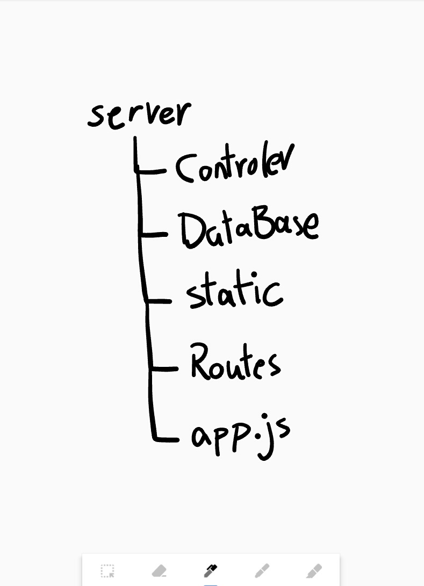

# Full Stack tutorial (master)
2022-March 

v1.0 = version 1.0 

<table>
    <tr style="font-weight: bold; color: gray">
        <td style="color: lightgray">Class Date</td>
        <td>Branch</td>
        <td>Description</td>
    </tr>
    <tr>
        <td style="color: lightgray">March-12</td>
        <td>v0.9</td>
        <td>html css - get data from a form</td>
    </tr>
    <tr>
        <td style="color: lightgray">March-13</td>
        <td>v1.0</td>
        <td>only app.js and DataBase</td>
    </tr>
    <tr>
        <td style="color: lightgray">March-18</td>
        <td>v1.1.0</td>
        <td>all routes in app.js</td>
    </tr>
    <tr>
        <td style="color: lightgray">March-19</td>
        <td>v1.1.1</td>
        <td>relocate all routes to Routes/index.js</td>
    </tr>
    <tr>
        <td style="color: lightgray">March-20</td>
        <td>v1.1.2</td>
        <td>Define Function1 & Function2 </td>
    </tr>
    <tr>
        <td style="color: lightgray">March-21</td>
        <td>v1.1.3</td>
        <td>relocate Function1 & Function2 to Functions folder</td>
    </tr>
    <tr>
        <td style="color: lightgray">March-22</td>
        <td style="color: lightgray">v1.1</td>
        <td style="color: lightgray">same as branch v1.1.3</td>
    </tr>
    <tr>
        <td style="color: lightgray">March-23</td>
        <td>v1.2</td>
        <td>
            v1.0 & v1.1 Together
            <ol style="font-size: 10px">
                <li>from v1.0 bring Database folder </li> 
                <li>from v1.1 bring Functions folder </li>
                <li>rename Functions folder to Controllers</li>
                <li>change Controllers folder content</li>
            </ol>
        </td>
    </tr>
    <tr>
        <td style="color: lightgray">March-24</td>
        <td style="color: lightgray">master</td>
        <td style="color: lightgray">Docs about Branches</td>
    </tr>
</table>

## img folder 

take a look at `img folder` architecture!

